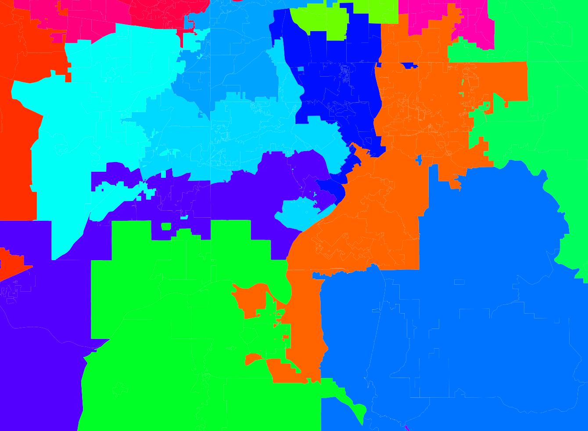
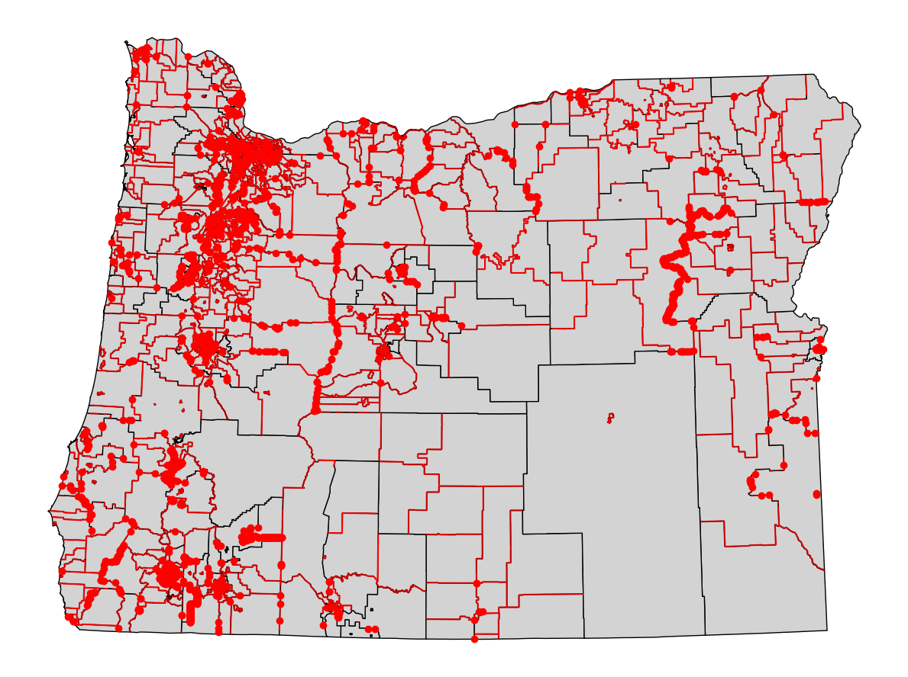

## Oregon

First we tried Oregon, that did not work because of too many overlaps and `smart_repair()` not providing acceptable data:
 
This is a snippet from the Oregon map after 19000 iterations:

Each color is one district! 
As you can see, there are a lot of holes where one district is inside another one.

One reason for this might be, that the data of Oregon is not very good. The data of Oregon has a lot of overlaps:

## Illinois

